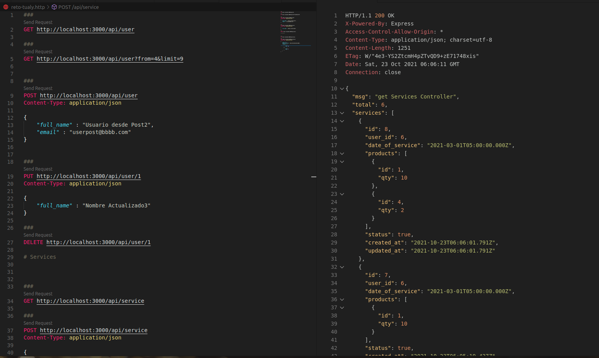
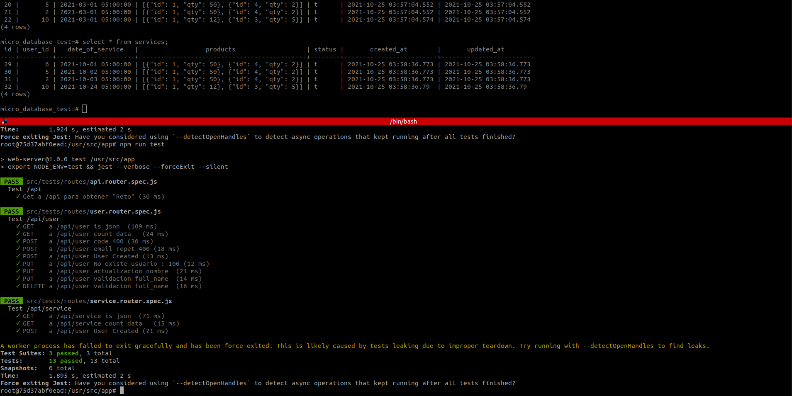

# reto-tualy
Reto de código - V1


## Descripcion y listado de actividades 

Se utiliza notion para tener un acceso rapido de la informacion y una nocion basica de las
tareas por hacer


> https://favill0n.notion.site/Tualy-d77d258f1dd14fdd85a8ee77ae68c555

## Variables en el .env

Se debe copiar el archivo `example.env` y crear el archivo `.env` con los siguientes valores

```text
PORT_SERVER=3000
OWNER_CONTAINER="favillon"
NAME_CONTAINER="skeleton-tualy"
VOLUMEN_BD="database"
HOST_BD=bd
PORT_BD=5431
POSTGRES_USER=root
POSTGRES_PASSWORD=masterroot
POSTGRES_DB=micro_database
POSTGRES_DB_TEST=micro_database_test
NODE_ENV=production
REDIS_PORT=6379
REDIS_PORT_COMMANDER=8081
HOST_REDIS="redis"
HASHMAILTRAP="4691c277aec232:8ba0f8498c238d"
```


## Levantar el proyecto

Crear el volumen manualmente

```shell
docker volume create --name=bd-database-skeleton-tualy
```

Levantar los contenedores

```shell
docker-compose up -d
```

Conectase por psql

> psql -h localhost -p 5431  -Uroot micro_database 

Ingresar contraseña definidad en el `.env` por la variable `POSTGRES_PASSWORD`

## EndPoints de Acceso

En el repo se encuentra el archivo `reto-tualy.http` aca se encuentrar los endpoint para el consumo de los servicios

Se puede usar la extension de vscode `humao.rest-client` [github](https://github.com/Huachao/vscode-restclient)  o [market](https://marketplace.visualstudio.com/items?itemName=humao.rest-client)





## Ejecucion de los test

Se realizaron test en base a todos los servicios expuestos 




## Diagrama BD

[Diagrama](https://dbdiagram.io/embed/61723a446239e146477cfd0f)